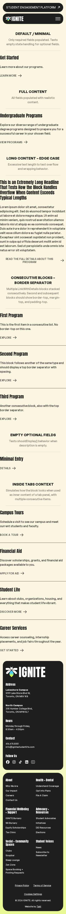
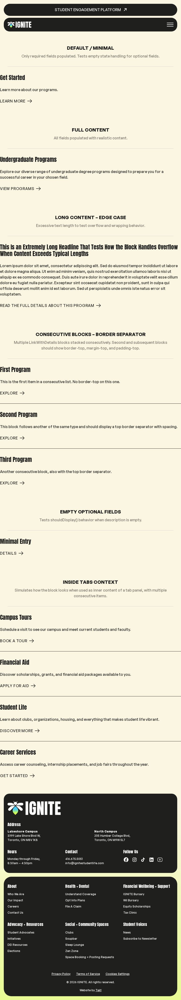
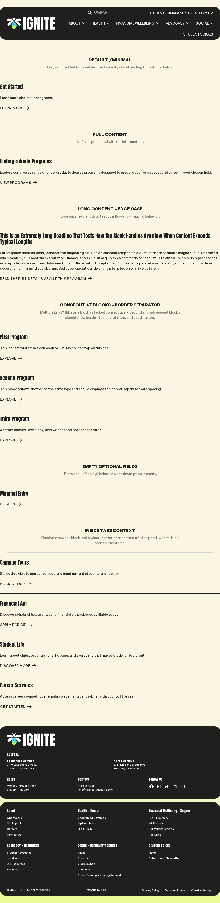
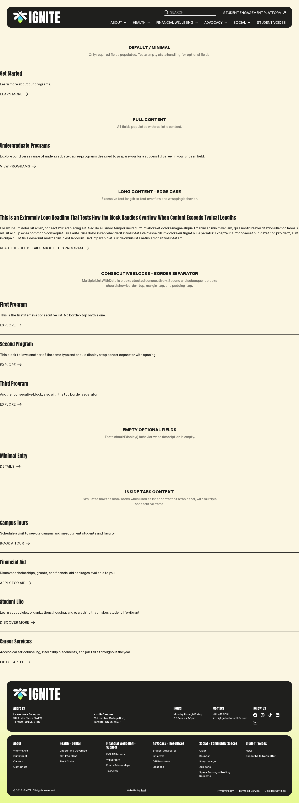

# LinkWithDetails Block

**Date:** 2026-03-11 12:08 PDT
**Test Page:** [https://ign.localhost/test-link-with-details/](https://ign.localhost/test-link-with-details/)

> This is an inner block with a headline, description, and tertiary button link. Designed to be used inside tab panels.

## Requirements

### User Requirements
- [x] Headline field displayed as h3 heading at 24px (text-header-5)
- [x] Description paragraph below headline (optional, hidden when empty)
- [x] Single tertiary button link with arrow icon
- [x] 24px gap between headline, description, and button
- [x] Consecutive blocks show border separator with 32px margin and padding
- [x] Block is an inner block for use inside Tabs panels
- [x] Only the button is clickable, not the entire block

### Block Type Requirements
- [x] Proper heading hierarchy (h3 for inner block inside h2 context)
- [x] Semantic HTML (heading, paragraph, anchor)
- [x] Native link element with implicit link role
- [x] Keyboard navigation support (Enter key executes link)
- [x] Focus-visible outline for all focusable elements
- [x] No hardcoded colors (uses theme tokens)

## Block Behavior

The LinkWithDetails block displays a headline, optional description, and a tertiary button link in a vertical stack. The headline is always visible and uses a large Anton font at 24px. The description appears below the headline when it contains content; if left empty, it is hidden. The button link appears at the bottom and is the only interactive element on the block — clicking the surrounding content does not navigate.

When multiple LinkWithDetails blocks are stacked consecutively (one after another), all blocks after the first show a top border separator with increased spacing above and below. This visual separation makes it easy to distinguish between separate entries when many blocks are grouped together, such as in a list of program offerings inside a tab panel.

The block adapts to all screen sizes without layout changes — the headline, description, and button remain in a single column on mobile, tablet, and desktop. The width of the block is determined by its parent container (usually a Tabs panel), so it flows naturally within any layout context.

## Development Notes

No notable exceptions or decisions.

## Issues to Address

**Outstanding:**

- **[FQA-002] ThemeButton whitespace (minor, external)** — The ThemeButton.php component outputs the btn-tertiary anchor with leading newline and trailing tab whitespace in the class attribute. This is cosmetic and has no functional impact. The issue exists in ThemeButton itself, not in LinkWithDetails, and is out of scope for this block.

## Test Results

### Validation Summary

| Check | Status | Notes |
|-------|--------|-------|
| Build (TypeScript) | PASS | Compiles without errors |
| Lint | PASS | Fixed via bun run format (CRLF removed) |
| Block Registration | PASS | block.json valid, apiVersion 3 |
| TSX/PHP Sync | PASS | Structure and attributes match |
| Attributes | PASS | 4 attributes defined with correct types and defaults |
| Edge Cases | PASS | Long content, empty fields, consecutive blocks all handled |
| Accessibility | PASS | Native link element, correct heading hierarchy, focus-visible |
| Spec Compliance | PASS | All requirements met |

### Screenshots

**Mobile (375px)**

**Tablet (768px)**

**Laptop (1024px)**

**Desktop (1440px)**

### Test Cases

| Variation | Purpose | Result |
|-----------|---------|--------|
| Default / Minimal | Required fields only; tests empty description handling | PASS |
| Full Content | All fields populated with realistic content | PASS |
| Long Content | Edge case: excessive text to test wrapping | PASS |
| Consecutive Blocks | Multiple blocks stacked; tests border separator | PASS |
| Empty Optional Fields | Description field empty; tests shouldDisplay() behavior | PASS |
| Inside Tabs Context | Simulates use as inner content of a tab panel | PASS |

### What Matched

- **Typography:** h3 renders in Anton font (text-header-5 utility) at 24px; description in General Sans with font-medium weight
- **Spacing:** 24px gap (gap-6) between headline, description, and button; 32px margin-top and padding-top for consecutive blocks
- **Colors:** No hardcoded colors; uses theme tokens (e.g., border-charcoal for separator)
- **Components:** ThemeButton always tertiary with arrow icon; cannot be changed
- **Layout:** Single-column flex layout with no breakpoint-specific changes; width determined by parent container
- **Interactive:** Only the button link is clickable; block wrapper has no click handler
- **Accessibility:** Native heading (h3) and link elements; proper focus-visible outline on button

## Changelog

| Timestamp | Change |
|-----------|--------|
| 2026-03-11 11:43 PDT | Planning: spec generated for LinkWithDetails inner block |
| 2026-03-11 11:52 PDT | Developer: all block files created, build passing |
| 2026-03-11 11:42 PDT | Functional QA: 11 checks, 9 passed, 1 failed (CRLF line endings, minor) |
| 2026-03-11 12:06 PDT | Developer: Fixed CRLF via bun run format, all validations pass |
| 2026-03-11 12:07 PDT | Functional QA: Post-fix verification PASS, no regressions |
